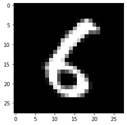
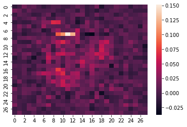
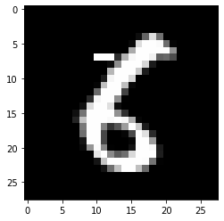
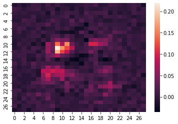
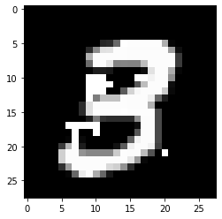
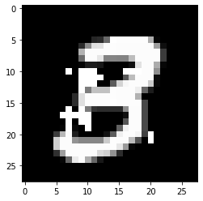

# Some adversarial attempts on MNIST

## 1. Abstract 

This project

1. Trained a model (will be refered as orginal model later) to predict the handwritten digits (MNIST) dataset
2. Collect the flip of points on image, to make the model recognize the image to a wrong number
3. Explain that the greedy approach for collecting flips is reasonable
4. Train the adversarial model based on the collected flips
5. Use the adversarial model to create examples to mislead original model and validate the attack success rate
6. Train a distillation model from original model
7. Compare the recognition on adversarial examples generated from adversarial model for original model and distillation model

## 2. Design of experiment

1. Model on MNIST

   The model for MNIST comes directly from [Keras](https://keras.io/examples/vision/mnist_convnet/). The file locates at `model.py`

   ```
      Model: "sequential"
      _________________________________________________________________
       Layer (type)                Output Shape              Param #
      =================================================================
       conv2d (Conv2D)             (None, 26, 26, 32)        320

       max_pooling2d (MaxPooling2D  (None, 13, 13, 32)       0
       )

       conv2d_1 (Conv2D)           (None, 11, 11, 64)        18496

       max_pooling2d_1 (MaxPooling  (None, 5, 5, 64)         0
       2D)

       flatten (Flatten)           (None, 1600)              0

       dropout (Dropout)           (None, 1600)              0

       dense (Dense)               (None, 10)                16010

      =================================================================
      Total params: 34,826
      Trainable params: 34,826
      Non-trainable params: 0
   ```

2. Flip of points

   There is explanation why to use flips (rather than changing greyscale in certain ways) in [progress report 2](progress.md)(I missed the due date and when I finished it I found only 2 people submitted, so I am just attaching the report along with this final report). 
   After around 7 days running at server (Intel(R) Xeon(R) Platinum 8260 CPU @ 2.40GHz, not any fancy performance CPU, but not bad) collected 7000 sets of points to attck the original model.

   The file used in this part is `run.py`

3. Greedy explanation

   Assume if we have the points, we want to prove that the greedy approach (find each flip of points that lower the original confidence most) will yield the least amount of flips to mislead the original model. We design a small experiment to explain that greedy approach will produce __reasonable small amount__ of flips to mislead the original model.

   Assume we have points, we pin 2 random points from the sequential lowest to the collection, then use the same approach to find the flips to lower the original model confidence. Then we compare the random pinned points to the original sequential points, to see the difference.

   The result is that, if we pin 2 random points of sequential points and find the flips, the same points versus the different points is 332-140 (for small amount of tests as finding these points is very time-consuming). The points of same amount of points and less versus larger is 68-7. That is, with our greedy approach, it will produce reasonably least amount of points to lower the original model confidence.

    The source code for testing locates at `greedy_check.py` and `greedy_compare.py`

4. Train adversarial model  
   
   From above we have collected the points to attack the original model, we want to train an adversarial model on the original model. An observation from the points we collected is that on average, we need 6.7 points to make original model recognize the image as wrong number.

   I tried train the model to predict x positions (tried 5 and 7) that will lower the original model confidence, that is the model input shape to output shape `28*28*1 -> x*2*1` However, after many attempts, I can't managed to train the model with a reasonable accuracy, most of the time the models will converge the accuracy at 0.114, I am not sure why.

   Then, I tried to train a model that have the points marked as 1 laying on empty 28*28 zero array, then use similar layers in original model, to creare the adversarial model. 

    ```
      Model: "sequential_21"
      _________________________________________________________________
       Layer (type)                Output Shape              Param #   
      =================================================================
       conv2d_31 (Conv2D)          (None, 25, 25, 32)        544       
                                                                       
       max_pooling2d_40 (MaxPoolin  (None, 12, 12, 32)       0         
       g2D)                                                            
                                                                       
       flatten_22 (Flatten)        (None, 4608)              0         
                                                                       
       dropout_20 (Dropout)        (None, 4608)              0         
                                                                       
       dense_19 (Dense)            (None, 784)               3613456   
                                                                       
       reshape_14 (Reshape)        (None, 28, 28, 1)         0         
                                                                       
      =================================================================
      Total params: 3,614,000
      Trainable params: 3,614,000
      Non-trainable params: 0
    ```
    
    ```
    Epoch 1/5
      44/44 [==============================] - 1s 27ms/step - loss: 0.0299 - accuracy: 0.9793 - val_loss: 0.0073 - val_accuracy: 0.9927
    ```

5. To create adversarial examples
    
    The output of such model o a 28*28*1 array is a 28*28*1 array, and the positions range from 0-1, so we need a factor that multiple the position. For example, assume we have 0.13 at position (2,5), we set the multiple to be 20, then it become 2.6 at point (2,5), we limit each point at max 1, so point (2,5) become 1, other points if less than 1 we change that point to 0 (by convert each point to type int). Test run the images and see how big `multiple_factor` will change the recognition from original model, the higher this factor is, our model will need more points to mislead the original model.

    After test on around 2000 images, I found that the average for such multiple factor is 276, and most of the image will share a similar shape for attack. If we feed the output from the adversarial model to heatmap, we can see that at which position attack will more likely happen (at least the model think so)
    For example, if we have a image that looks like this  
       
      
    Original  5 Now  9  
        
      
    Original  6 Now  8


6. Train distillation model

    Based on the paper [Distillation as a Defense to Adversarial Perturbations against Deep Neural Networks](https://arxiv.org/abs/1511.04508)  
    I first processed the y_train predicted by original model (10*1 array such as [1.8107850e-11 2.7473806e-07 4.2569755e-07 5.5906617e-06 3.4349390e-13 3.9189835e-11 1.4915251e-17 9.9999321e-01 1.0969632e-07 3.4083357e-07])

    ```
      Model: "sequential_38"
      _________________________________________________________________
       Layer (type)                Output Shape              Param #   
      =================================================================
       conv2d_61 (Conv2D)          (None, 26, 26, 32)        320       
                                                                       
       max_pooling2d_70 (MaxPoolin  (None, 13, 13, 32)       0         
       g2D)                                                            
                                                                       
       conv2d_62 (Conv2D)          (None, 11, 11, 64)        18496     
                                                                       
       max_pooling2d_71 (MaxPoolin  (None, 5, 5, 64)         0         
       g2D)                                                            
                                                                       
       flatten_41 (Flatten)        (None, 1600)              0         
                                                                       
       dropout_36 (Dropout)        (None, 1600)              0         
                                                                       
       dense_39 (Dense)            (None, 10)                16010     
                                                                       
      =================================================================
      Total params: 34,826
      Trainable params: 34,826
      Non-trainable params: 0
    ```


7. Attack the distillation model

    Recall the multiply_factor that controls the points added to the attacked image, this number reflects how `hard` to attack the model. As we have trained the distillation model, we want to validate that whether te proposed distillation model is more robust against attacks, so we randomly check what is the multiply_factor to change the prediction of original model and distillation model, compare the multiply_factor we can see the robustness of these 2 models.  
    For example, the original image  
    

    the heatmap for attack points  
    
    
    The minimum multiply_factor to attack the original model is shown on left, and the minimum multiply_factor to attack the distillation model is shown on the right side  
    

    We can see it need few more points to attack the distillation model

    Then, we run tests on these 2 models and check the average multiply_factor for original model and distillation model.

    And check 600 random images out of the train images, that the average factor to mislead the original model is 23, while the average for distillation model is 27, which shows the distillation model has better robustness than the original model


References:
[1] Papernot, Nicolas, et al. "Distillation as a defense to adversarial perturbations against deep neural networks." 2016 IEEE symposium on security and privacy (SP). IEEE, 2016.  
[2] Athalye, Anish, Nicholas Carlini, and David Wagner. "Obfuscated gradients give a false sense of security: Circumventing defenses to adversarial examples." International conference on machine learning. PMLR, 2018.  
[3] MNIST Adversarial Examples Challenge https://github.com/MadryLab/mnist_challenge  
[4] mnist-adversary https://github.com/dguliani/mnist-adversary  
[5] Simple MNIST convnet https://keras.io/examples/vision/mnist_convnet/  
[6] Help from my friend Sida Zhu  